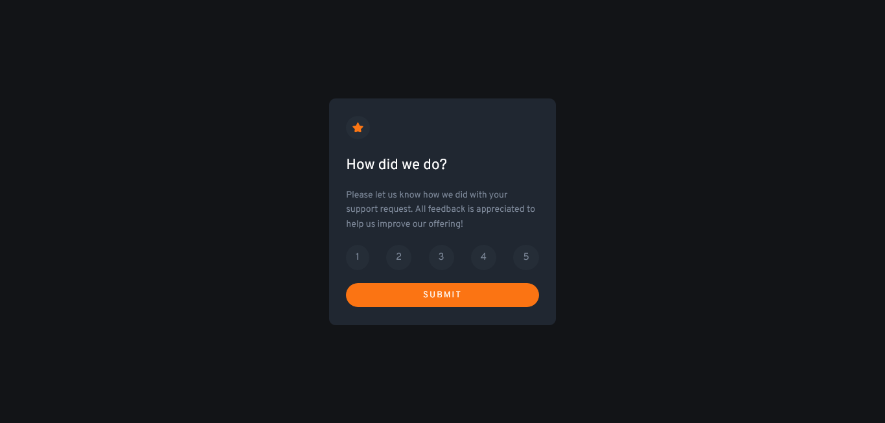

# Frontend Mentor - Interactive rating component solution

This is a solution to the [Interactive rating component challenge on Frontend Mentor](https://www.frontendmentor.io/challenges/interactive-rating-component-koxpeBUmI). Frontend Mentor challenges help you improve your coding skills by building realistic projects. 

## Table of contents

- [Overview](#overview)
  - [The challenge](#the-challenge)
  - [Screenshot](#screenshot)
  - [Links](#links)
- [My process](#my-process)
  - [Built with](#built-with)
  - [What I learned](#what-i-learned)
  - [Useful resources](#useful-resources)
- [Author](#author)

## Overview

### The challenge

Users should be able to:

- View the optimal layout for the app depending on their device's screen size
- See hover states for all interactive elements on the page
- Select and submit a number rating
- See the "Thank you" card state after submitting a rating

### Screenshot



### Links

- Solution URL: [interactive-rating-component-main](https://github.com/saulgutierrez/interactive-rating-component-main)
- Live Site URL: [interactive-rating-componente-main](https://deluxe-bublanina-ec7435.netlify.app/)

## My process

### Built with

- Semantic HTML5 markup
- CSS custom properties
- Flexbox
- Javascript
- Google Fonts

### What I learned

Add an event listener before a click event, at the moment of load:

```js
window.addEventListener("load", () => {
  ...
});
```

Change HTML text with Javascript:

```js
rating.innerHTML = "You selected 1 out of 5";
```

Alter display attribute with Javascript:
```js
  ratingCard.style.display = "none";
  thankYouState.style.display = "flex";
```

This helped me to avoid refreshing the page, or submit a form to another page.

### Useful resources

- [HTMLElement: load event](https://developer.mozilla.org/en-US/docs/Web/API/HTMLElement/load_event) - This helped me to understand the load event in Javascript.

## Author

- Website - [Saúl Gutiérrez](https://sauladai.netlify.app/)
- Frontend Mentor - [@saulgutierrez](https://www.frontendmentor.io/profile/saulgutierrez)